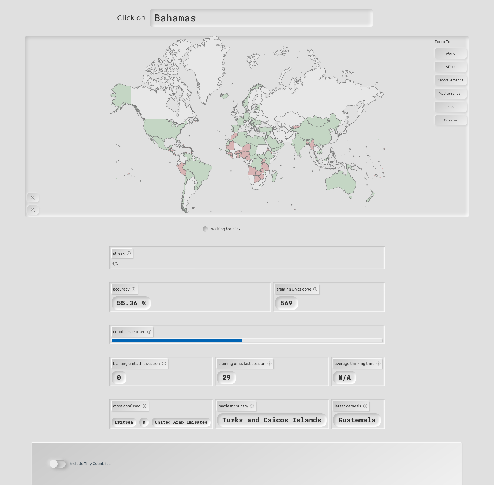

# World Map Practice

This is a little tool I built to get better at [this GeoGuessr challenge](https://www.geoguessr.com/vgp/3355).

**Check it out [here](https://learn-worldmap.netlify.app/)** (free, no signup, no download)

## Tech Stack

A horrible mess of code in a single `index.html`. Vanilla JavaScript. Also using [funcssion](https://funcssion.com/) and [this svg map](https://github.com/VictorCazanave/svg-maps/tree/master/packages/world)

## FAQ

### What does thing thing do?

It's essentially a quizz where you need to click the right country on a world map. A simple [Spaced Repetition](https://en.wikipedia.org/wiki/Spaced_repetition) algorithm tracks which countries are easy and which are hard so that they can be repeated at useful intervals.

The goal is that you are able to place every country (and territory) on the map at its correct place. Why? Why not!

### How is my data handled?

No personal data leaves your computer. Your learning data is saved in your LocalStorage, so you can continue your practice at a later point. I track plain page views with the privacy-friendly tool [GoatCounter](https://www.goatcounter.com/)

### Can I contribute/modify this?

Yes. You can download this repo and simply open `index.html` in any browser. It should work. You can also use a small live server, such as can be installed as a VS Code plugin or CLI tool, but it's not strictly needed.

If you have trouble, feedback or ideas, feel free to open an issue - or a PR!